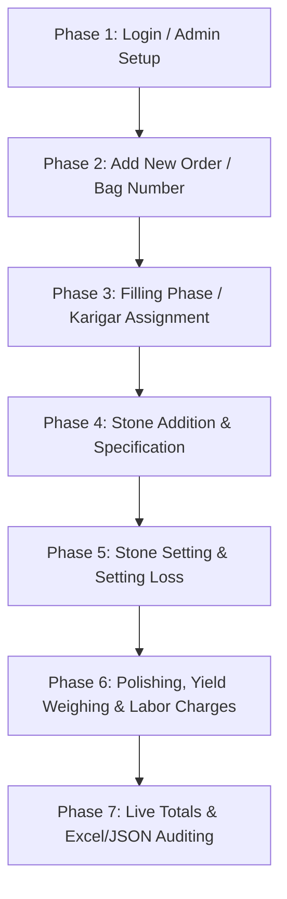

# 🏆 Jewellery Production Register - Version 2
## 📖 Complete Application Workflow Guide (End-to-End Ledger System)

Welcome to the comprehensive workflow guide for the **Jewellery Production Register (Version 2)**. This application is a custom-built, modern Next.js ERP register designed to track the full manufacturing lifecycle of jewellery, monitor raw gold material, manage karigar assignments, record stone weights, calculate real-time losses, and handle production bookkeeping with Excel reporting and robust data backup utilities.

---

## 🧭 Table of Contents
1. [🌟 System Architecture & Core Stack](#-system-architecture--core-stack)
2. [🚀 Step-by-Step Business Flow (Start to End)](#-step-by-step-business-flow-start-to-end)
   - [Phase 1: Admin Onboarding & Session Security](#phase-1-admin-onboarding--session-security)
   - [Phase 2: Order Initialization (Bag Registration)](#phase-2-order-initialization-bag-registration)
   - [Phase 3: The Multi-Stage Manufacturing Ledger](#phase-3-the-multi-stage-manufacturing-ledger)
   - [Phase 4: Granular & Cell-Level Ledger Audits](#phase-4-granular--cell-level-ledger-audits)
   - [Phase 5: Aggregate Totals & Live Reconciliation](#phase-5-aggregate-totals--live-reconciliation)
   - [Phase 6: Data Portability (Excel Export & JSON Backup)](#phase-6-data-portability-excel-export--json-backup)
3. [✨ Feature Modules & System Capabilities](#-feature-modules--system-capabilities)
4. [🗄️ Database Architecture & Collection Schemas](#%EF%B8%8F-database-architecture--collection-schemas)
5. [🔌 API Endpoints Reference](#-api-endpoints-reference)
6. [💡 System Rules & Pro Tips](#-system-rules--pro-tips)

---

## 🌟 System Architecture & Core Stack

The system is engineered as a highly optimized, high-fidelity Single-Page Dashboard utilizing **Next.js 16 (App Router)** and **MongoDB** as its database engine.

```
┌────────────────────────────────────────────────────────┐
│                   BROWSER CLIENT                       │
│  React 19, Tailwind CSS, Lucide Icons, Custom Modals   │
└───────────┬────────────────────────────────┬───────────┘
            │                                │
      HTTP Requests                    Serve Images
   (JSON Data / Excel)               (Buffer Stream)
            │                                │
┌───────────▼────────────────────────────────▼───────────┐
│                 NEXT.JS BACKEND (API)                  │
│   NextAuth (JWT), Mongoose, GridFS Bucket (Image Storage)│
└───────────────────────────┬────────────────────────────┘
                            │
                      Database Queries
                            │
┌───────────────────────────▼────────────────────────────┐
│                    MONGODB DATABASE                    │
│      Collections: 'users', 'orders', GridFS buckets    │
└────────────────────────────────────────────────────────┘
```

### Core Technologies
*   **Next.js 16 (App Router) & React 19:** Powers the server-side APIs and interactive client dashboard.
*   **Mongoose & MongoDB:** Houses order details and credentials with high-performance querying.
*   **GridFS Bucket (`orderPhotos`):** Handles large binary files (jewellery design photos) directly inside MongoDB to keep file management unified and portable.
*   **Tailwind CSS & Vanilla CSS Transitions:** Delivers a gorgeous, responsive, glassmorphic layout.
*   **XLSX (SheetJS):** Formats and generates custom Excel (.xlsx) spreadsheets on the fly with custom column widths, titles, and mathematical calculations.
*   **NextAuth & Bcrypt.js:** Ensures dashboard endpoints and views are locked behind secure authentication.

---

## 🚀 Step-by-Step Business Flow (Start to End)

The chronological lifecycle of how raw materials, artisan labor, stone settings, and finished goods are registered, updated, and logged inside the system:



### Phase 1: Admin Onboarding & Session Security
1.  **Bootstrapping the System:** During the first startup, the Mongoose adapter inspects the `users` collection. If no administrator exists, it automatically seeds a default admin account:
    *   **Username:** `admin`
    *   **Password:** `admin123`
2.  **Login & Session:** Users must authenticate at `/login`. Upon verification via `bcrypt.js`, the system grants a JWT (JSON Web Token) session cookie with a **24-hour expiration duration**.
3.  **Credential Management:** The dashboard provides a **"Change Password"** button in the toolbar. Clicking this prompts the user for their current password and hashes the new password with a high-entropy salt factor (12 rounds) before updating it in the database.

---

### Phase 2: Order Initialization (Bag Registration)
When raw precious metal is weighed and allocated into a production packet (called a **"Bag"**), the administrator logs it into the register.
1.  **Add Row Modal:** Click the **"Add Row"** button in the dashboard toolbar.
2.  **Define Bag Parameters:**
    *   **Bag Number (Required):** The unique identifier tag tied to the physical production pouch.
    *   **Order Name (Required):** The name/description of the jewellery design (e.g., *Gold Bridal Ring - Flower Pattern*).
    *   **Karat (KT):** The target gold purity (e.g., *22K*, *18K*, *92%*, etc.).
3.  **Optional Design Photo:** Drag or upload an image file (under 5MB). The system automatically converts the image to an array buffer and streams it to **MongoDB GridFS**, returning a `fileId`.
4.  **Save:** Submitting creating the record. The table dynamically updates with the new entry showing a **serial number (Sr No)**.

---

### Phase 3: The Multi-Stage Manufacturing Ledger
Once a Bag is initialized, it goes through various workshops. At each stage, the system tracks weights and losses to ensure complete karigar accountability.

#### Stage 1: The Filling Phase
*   **Assign Karigar:** The administrator enters or selects the `Filling Karigar` (e.g., *Imran Khan*). The system uses autocomplete lists (`datalists`) generated from the history of all existing karigars to avoid typing errors.
*   **Gold Input (`fillingIn`):** Enter the weight of raw gold/components given to the karigar in grams (e.g., `12.500 g`).
*   **Gold Output (`fillingOut`):** Enter the weight of rough-shaped jewellery components returned by the karigar in grams (e.g., `12.350 g`).
*   **Automatic Loss Calculation:** Mongoose uses a pre-save hook that automatically calculates the **Filling Loss:**
    $$\text{Filling Loss} = \text{Filling In} - \text{Filling Out}$$
    *(Example: $12.500\text{g} - 12.350\text{g} = 0.150\text{g}$ loss. If gold was added or recovered, it displays as a negative loss in green.)*

#### Stage 2: Stone Allocations (AD & KL Stones)
Before setting, the stones are weighed and registered:
*   **AD Weight & Note:** Input the weight of American Diamonds (AD) added in grams and any specific notes (e.g., `1.200 g` AD, `52 pieces`).
*   **KL Stone Weight & Note:** Input the weight of Kailash / Kundan (KL) stones added in grams and specific notes (e.g., `2.300 g` KL, `Oval cut`).

#### Stage 3: The Stone Setting Phase
*   **Assign Setter:** Enter or select the `Setting Karigar`.
*   **Setting Loss:** Input the weight of gold dust/scraps lost during stone setting.

#### Stage 4: The Polishing & Finishing Phase
*   **Assign Polisher:** Enter or select the `Polish Karigar`.
*   **Polish Loss:** Input the gold lost during final buffing/polishing.
*   **Finish Weight:** Weigh the completed, finished jewellery item (metal + stones) and log it in grams.
*   **Making Charge:** Input the labor charges (customarily calculated in grams of gold or currency equivalents).

---

### Phase 4: Granular & Cell-Level Ledger Audits
Rather than forcing admins to open bloated edit pages, the register offers an **Interactive Grid-Style Cell Editor**:

```
┌────────────────────────────────────────────────────────┐
│  CELL-LEVEL EDITOR MODAL (EDIT CELL)                   │
├────────────────────────────────────────────────────────┤
│  Bag: BAG-1092  │  Field: Filling In  │  Current: 12.5g│
│                                                        │
│  👉 Choose Update Mode:                                │
│  (🔘) Add to existing value                            │
│  (  ) Replace completely                               │
│                                                        │
│  Amount: [ 1.250 ]  g                                  │
│                                                        │
│  🔥 Live Preview Calculation:                          │
│     12.500 g + 1.250 g = 13.750 g                      │
│                                                        │
│                   [ Cancel ] [ Save Changes ]          │
└────────────────────────────────────────────────────────┘
```

1.  **Trigger Edit:** Click directly on any text or numeric cell in the table.
2.  **Interactive Updates:**
    *   **Text/Note Fields:** Standard text boxes appear with existing values, allowing quick corrections.
    *   **Numeric Fields:** The modal gives two modes:
        1.  **Add to Existing Value (Additive Mode):** Extremely useful for ongoing production. If a karigar is given an extra `1.250g` of gold for casting, type `1.250` and select "Add to existing". The backend automatically computes the mathematical sum.
        2.  **Replace Completely (Replace Mode):** Overwrites the previous value.
3.  **Recalculate Hooks:** Upon save, the Mongoose schema recalculates all loss formulas and updates the entire table row in real-time.

---

### Phase 5: Aggregate Totals & Live Reconciliation
The register table is backed by a **Global Totals System** situated in the footer (`<tfoot>`):
*   **Dynamic Computations:** The backend calculates the mathematical sum for **all matching database entries** based on current filters (not just the paginated 50 rows visible on the screen).
*   **Aggregated Columns:**
    *   Total Filling Input vs Total Filling Output
    *   Net Filling Loss (highlighted in red)
    *   Total AD & KL Stone Weights
    *   Total Setting & Polish Losses
    *   Sum of Finished Goods Yield (Finish Weight)
    *   Sum of Manufacturing Charges (Making Charges)
*   **Artisan Performance Auditing:** The API evaluates the cumulative gold loss metrics for every unique karigar, showing their overall production efficiency.

---

### Phase 6: Data Portability (Excel Export & JSON Backup)

To ensure the business can run offline and keep records forever, the ERP integrates a dual-layer data portability system:

#### 1. Formatted Excel Exports (.xlsx)
*   Clicking **"Export Excel"** makes a query to `/api/orders/export`.
*   It fetches all matching orders (complying with the active date filter and search text).
*   It generates a spreadsheet complete with proper headers, custom column widths, serial numbers, formatted dates (`en-IN` standard), and a **final rounded total row**.
*   The document downloads instantly with an audit-compliant filename: `Production_Register_YYYY-MM-DD.xlsx`.

#### 2. Complete Database Backups
*   **JSON Download:** The **"Backup"** utility compiles the complete collection of users and orders into a structured JSON file containing audit metadata (export timestamp, software version, count).
*   **JSON Restore:** Admins can upload any previous JSON backup file. The system processes the file, strips out conflicting database identifiers, applies validations, saves new records, and gives a status report detailing exactly how many orders were successfully imported or skipped.

---

## ✨ Feature Modules & System Capabilities

### 🎛️ 1. Global Debounced Searching
*   Type anything into the search bar.
*   The system uses a React hook debouncer that waits for **300ms** of silence before triggering the backend search API.
*   Matches both **Bag Numbers** and **Order Names** case-insensitively using Mongo Regex indexes.

### 📅 2. Real-time Date Filtering
*   Allows sorting and filtering production logs with instant state updates:
    *   **Today:** Shows entries created from midnight of the current day.
    *   **This Week:** Shows orders registered within the past 7 days.
    *   **This Month:** Shows orders registered within the past 30 days.
    *   **All Time:** Shows the entire register database history.

### 🖼️ 3. Full-Screen Image Lightbox
*   Orders display a thumbnail photo of the design if uploaded.
*   Clicking the thumbnail opens a full-screen blurred glassmorphic overlay **(Lightbox)**.
*   The overlay provides an instant high-resolution design reference. Clicking anywhere outside the photo closes the preview instantly.

---

## 🗄️ Database Architecture & Collection Schemas

The application structure consists of two high-performance collections and an integrated binary grid filesystem:

### 1. `User` (Credentials Collection)
Tracks authorized workshop operators.
```javascript
{
  _id: ObjectId,       // Unique identifier
  username: {
    type: String,      // User ID (lowercased and trimmed)
    required: true,
    unique: true
  },
  password: {
    type: String,      // High-entropy Bcrypt hash
    required: true
  },
  createdAt: Date,     // Audit timestamp
  updatedAt: Date
}
```

### 2. `Order` (Register Ledger Collection)
Tracks the primary jewellery production records.
```javascript
{
  _id: ObjectId,
  bagNumber: {
    type: String,
    required: true,    // Unique identifier for production pouches
    trim: true
  },
  karat: {
    type: String,      // Purity rating (e.g. "22K", "18K", "92%")
    default: ""
  },
  orderName: {
    type: String,
    required: true,    // Descriptive design name
    trim: true
  },
  fillingKarigar: String, // Assigned casting karigar
  fillingIn: {
    type: Number,      // Weight of raw gold issued
    default: 0
  },
  fillingOut: {
    type: Number,      // Weight of cast components returned
    default: 0
  },
  fillingLoss: {
    type: Number,      // Automatically computed pre-save
    default: 0
  },
  ad: {
    type: Number,      // Weight of AD stones added
    default: 0
  },
  adNote: String,      // Notes (e.g., AD stone count or size)
  klStone: {
    type: Number,      // Weight of KL stones added
    default: 0
  },
  klStoneNote: String, // Notes (e.g., KL stone count or size)
  settingKarigar: String, // Assigned stone-setting artisan
  settingLoss: {
    type: Number,      // Gold loss during setting
    default: 0
  },
  polishKarigar: String,  // Assigned polishing artisan
  polishLoss: {
    type: Number,      // Gold loss during final polish
    default: 0
  },
  finishWeight: {
    type: Number,      // Final scale weight of the product
    default: 0
  },
  makingCharge: {
    type: Number,      // Making charge/labor rate
    default: 0
  },
  orderPhoto: {
    type: String,      // GridFS ObjectId string pointing to stored image
    default: ""
  },
  createdAt: Date,
  updatedAt: Date
}
```

---

## 🔌 API Endpoints Reference

All ledger routes are guarded by JWT session filters. Unauthorized requests are blocked with a `401 Unauthorized` response.

### 👤 1. Authentication
*   `POST /api/auth/login` - Authenticates admin credentials and issues a cookie.
*   `POST /api/auth/logout` - Revokes the active session cookie.
*   `PUT /api/admin` - Updates current password (handles salt hashing).

### 📦 2. Production Orders Ledger
*   `GET /api/orders` - Fetches register items (supports `page`, `limit`, `search`, and `dateFilter` params) along with global totals and unique karigar lists.
*   `POST /api/orders` - Registers a new Bag entry.
*   `GET /api/orders/[id]` - Fetches details for a single row.
*   `PUT /api/orders/[id]` - Updates cell parameters (supports `additive: true` mode).
*   `DELETE /api/orders/[id]` - Deletes an order record.

### 📥 3. Data Utilities & Media
*   `POST /api/upload` - Uploads a JPEG/PNG/WebP image and saves it in GridFS.
*   `GET /api/images/[id]` - Streams raw image bytes directly from MongoDB GridFS with optimized cache control headers.
*   `GET /api/orders/export` - Exports the filtered data set as a compiled `.xlsx` Excel sheet.
*   `GET /api/backup` - Downloads all data as a formatted `.json` backup file.
*   `POST /api/backup` - RESTORES/IMPORTS a JSON backup into the active MongoDB.

---

## 💡 System Rules & Pro Tips

> [!IMPORTANT]
> **Additive Edit Precautions**  
> When using the cell editor to add gold weights (e.g., adding `0.500g` of gold), double-check that you select **"Add to existing"**. Selecting "Replace completely" will overwrite the historical value, erasing previous ledger records.

> [!TIP]
> **Karigar Performance Audits**  
> Keep spelling consistent when assigning Karigars. The system aggregates filling, setting, and polish losses based on exact spelling (case-sensitive and whitespace-trimmed). Using the dropdown autocompletes ensures consistent spelling across different bags.

> [!WARNING]
> **Image Size Limitations**  
> Uploading images larger than **5MB** or choosing non-image file extensions will prompt a validation error. The app automatically scans MIME types to prevent database security vulnerabilities.

> [!CAUTION]
> **Backup Restoration Behavior**  
> Importing a JSON backup will append orders. It will skip entries with structural validation errors rather than aborting. To avoid duplicate entries, verify whether the backup file contains items that have already been registered.

---
*AM Jewellers Production Register ERP (Version 2) workflow guide compiled on May 25, 2026.*
